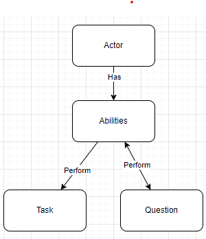

# Brightest ScreenPlay Package
A lightweight ScreenPlay Package
## ScreenPlay Design Pattern
The Screenplay Design Pattern, introduced by Serenity BDD framework, is a high-level, user-centered approach to test automation. 
It provides a way to describe tests in a way that closely resembles how end-users interact with the system. 
This pattern focuses on modeling the users journey through the application and representing it as a series of tasks. 
The main benefit of using this pattern is that it makes tests easy to understand, even for non-technical stakeholders, as the tests are described in terms of user actions.
The main pricle is displayed in this scema:

## Getting Started and how to use
In the ScreenPlay pattern, the Actors are the ones doing things. In the package, there are 2 Actors defined that can be used in your test solution:
- CallAnApi
- OpenAWebPage
### Create an ability 
One of the first things that you need to do when you want to use this package is to define an Ability class that can do things
This is an example class that uses the CallAnAPI actor class:
```csharp
using Bright.ScreenPlay.Abilities;
using ScreenPlayExample.Responses;

namespace x.y.z
{
	public class SomeApi : CallAnAPi
	{
		public SomeApi(){
			Settings.BaseUrl = "SomeUrl"
		}
	}
}
```
The package also has some extension methods that allow you to write something like this:
```csharp
var coBRHATypeZorgverleners = await restponse.Content.ReadAsJsonAsync<List<CoBRHATypeZorgverlener>>();
````
This is an example class that uses the OpenAWebPage Actor class
```csharp
using Bright.ScreenPlay.Abilities;
using OpenQA.Selenium;

namespace x.y.z
{
	public class SomePage: OpenAWebPage
	{
		public SomePage(){
			Settings.BaseUrl = "SomeUrl"
		}
		public SomePage OpenMainPage(IWebDriver webDriver)
		{
			WebDriver = webDriver;
			WebDriver.Navigate().GoToUrl(Settings.BaseUrl);
			WebDriver.Manage().Window.Maximize();
			WaitUntilElmentVisableByXpath("//a[@id='menuRegisterLink']");
			return this;
		}
	}
}
```
In the OpenAWebpage class, there are some methods that can be used to interact with the webpage.
### Create a Task
To ensure the actor can do things, you need to create Task classes.
This is an example of an implemented Task Class:
```csharp
using ScreenPlayExample.Abilities;
using Task = Bright.ScreenPlay.Tasks.Task;

namespace x.y.z
{
	public class TheTask : Task
	{
		public override void PerformAs(IPerformer actor) {}
		public static void RegisterNewCustomerAs(IPerformer actor, string firstName, string lastName, string eMail, string password)
        {
            var page = actor.GetAbility<BTubeMainPage>().OpenRegisterPage();
            page.FirstName = firstName;
            page.LastName = lastName;
            page.Email = eMail;
            page.Password = password;
            page.ConfirmPassword = password;
            page.Register();
        }
	}
}
```
### Create a question
To ensure the actor can ask the state of the program you need to create question classees.
This is an example of an implemented Question Class:
```csharp
using Bright.ScreenPlay.Actors;
using Bright.ScreenPlay.Questions;
using ScreenPlayExample.Abilities;

namespace x.y.z
{
	public TheQuestion : Question<List<string>>
	{
		public static async Task<List<string>> PerformGetCodeTableAs(IPerformer actor, string table)
		{
    			return await actor.GetAbility<CodeTableAPI>().GetCodeTable(table);
		}
		public override List<string> PerformAs(IPerformer actor)
		{
    			return new List<string>();
		}
	}
}
```
As you can see the Question class requires you to think about the response and also requires you to implement the PerformAs method.
### Create an actor
To make your tests more readable you can create an actor class.
In the actor class you can define the abilities that the actor has and also define the Taks and Questions the Actor can perform.
This is an example of an implemented Actor class:
```csharp
using Bright.ScreenPlay.Actors;
using ScreenPlayExample.Abilities;
using ScreenPlayExample.Questions;

namespace x.y.z
{
	public class Joe : Actor
	{
		public Joe() : base("Joe")
		{
			IsAbleToDoOrUse<SomeApi>();
		}
		public async Task<List<string>> GetCodeTable(string table)
		{
			return await TheQuestion.PerformGetCodeTableAs(this, table);
		}
	}
}
```
An example for an actor that can open a webpage:
```csharp
using Bright.ScreenPlay.Actors;
using CMDB.Domain.Entities;
using CMDB.UI.Specflow.Abilities.Data;
using CMDB.UI.Specflow.Abilities.Pages;
using CMDB.UI.Specflow.Questions;
using CMDB.UI.Specflow.Tasks;

namespace CMDB.UI.Specflow.Actors
{
    public class CMDBActor : Actor
    {
        protected readonly ScenarioContext _scenarioContext;
        protected readonly Random rnd = new();
        protected Admin admin;
        protected int rndNr;
        public  string ExpectedLog { get; set; }
        public CMDBActor(ScenarioContext scenarioContext, string name = "CMDB") : base(name)
        {
            IsAbleToDoOrUse<DataContext>();
            IsAbleToDoOrUse<LoginPage>();
            _scenarioContext = scenarioContext;
        }
        public async Task<Admin> CreateNewAdmin()
        {
            var context = GetAbility<DataContext>();
            admin = await context.CreateNewAdmin();
            return admin;
        }
        public void DoLogin(string userName, string password)
        {
            Perform<OpenTheLoginPageTasks>();
            var page = GetAbility<LoginPage>();
            page.TakeScreenShot($"{_scenarioContext.ScenarioInfo.Title}_{_scenarioContext.CurrentScenarioBlock}_Login");
            page.UserId = userName;
            page.TakeScreenShot($"{_scenarioContext.ScenarioInfo.Title}_{_scenarioContext.CurrentScenarioBlock}_EnterUserId");
            page.Password = password;
            page.TakeScreenShot($"{_scenarioContext.ScenarioInfo.Title}_{_scenarioContext.CurrentScenarioBlock}_EnterPassword");
            MainPage mainPage = Perform(new OpenTheMainPage());
            page.TakeScreenShot($"{_scenarioContext.ScenarioInfo.Title}_{_scenarioContext.CurrentScenarioBlock}_LogedIn");
            IsAbleToDoOrUse(mainPage);
        }
    }
}
```
### Usage in the tests
This is an example of how you can use the ScreenPlay package in your tests:
```csharp
using Bright.ScreenPlay.Actors;
using ScreenPlayExample.Abilities;
using ScreenPlayExample.Questions;

namespace ScreenPlayExample.StepDefinitions
{
    [Binding]
    public class CodeTableStepDefinitions
    {
        private Joe joe;
        private string _table;
        private List<string> _results;
        [Given(@"I want to search the (.*)")]
        public void GivenIWantToSearchTheTable(string table)
        {
            _table = table;
            joe = new Actor();
        }

        [When(@"I send the request to search the code table")]
        public async Task WhenISendTheRequestToSearchTheCodeTable()
        {
            _results = await joe.GetCodeTable(_table);
        }

        [Then(@"The results of that table should contain data")]
        public void ThenTheResultsOfThatTableShouldContainData()
        {
            _results.Should().NotBeEmpty();
            _results.Count.Should().BeGreaterThan(1);
        }
    }
}
```
an other example of how you can use the ScreenPlay package in your tests:
```csharp
using CMDB.Domain.Entities;
using CMDB.UI.Specflow.Actors;
using CMDB.UI.Specflow.Questions;

namespace CMDB.UI.Specflow.StepDefinitions
{
    [Binding]
    public class LoginStepDefinitions: TestBase
    {
        readonly CMDBActor actor;

        public LoginStepDefinitions(ScenarioContext scenarioContext) : base(scenarioContext)
        {
            actor = new(scenarioContext);
        }
        [Given(@"I open the home page")]
        public async Task GivenIOpenTheHomePage()
        {
            Admin = await actor.CreateNewAdmin();
        }
        [When(@"I logon with a valid user name and password")]
        public void WhenILogonWithAValidUserNameAndPassword()
        {
            actor.DoLogin(Admin.Account.UserID, "1234");
        }
        [Then(@"I can logon")]
        public void ThenICanLogon()
        {
            bool result = actor.Perform(new IsTheUserLoggedIn());
            result.Should().BeTrue();
        }
    }
}
```